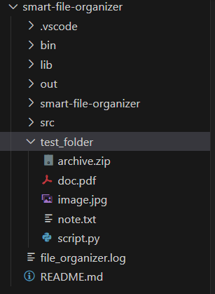

# Smart File Organizer

Smart File Organizer is a Java desktop application that automatically organizes the files in a selected folder into subfolders based on their file extensions. It includes a graphical interface, undo functionality, robust error handling, and detailed logging.

---

## Overview

This project was built as an object-oriented programming (OOP) exercise. It demonstrates key software engineering principles such as modular design, encapsulation, file system interaction, and graphical user interface (GUI) development with Java Swing.

Use cases include keeping a Downloads folder clean, organizing project assets, or batch-sorting mixed files.

---

## Getting Started

### 1. Clone the repository

git clone https://github.com/TomyRulliat-3ICS/ErasmusTask2.git
cd smart-file-organizer

### 2. Compile the project
Using Java 11 or higher:

javac -d out src/*.java

### 3. Launch the application

java -cp out OrganizerGUI

---

## Testing the Application

### Step 1: Create a test folder
The test_folder is usually already created with the project. However, you can freely add or modify files inside it for testing purposes.

If you need to recreate it manually:

mkdir test_folder
cd test_folder

Then, create five files of different types.

type nul > doc.pdf
type nul > image.jpg
type nul > script.py
type nul > note.txt
type nul > archive.zip

### Step 2: Use the app to organize the files
Open the app :

java -cp out OrganizerGUI

Click Browse to select test_folder

Click Start to begin sorting

The app will:

Create subfolders for each file extension

Move each file into the appropriate subfolder

Log the actions performed

### Step 3: Undo the last operation
Click Undo to revert the last file movement. If the folder that was created becomes empty, it will be deleted automatically.

And then we can see that the folder disappears.

By undoing all actions, we end up where we started.

And then we can see that all folders disappears.

---

## Features

- Sort files by extension automatically

- Create folders on the fly

- Move files using Java NIO

- Track file moves with timestamps

- Undo last operation with folder cleanup

- Graphical interface using Swing

- Full error handling (permissions, name conflicts, etc.)

---

## Logging

Each file move is logged with:

- Source path

- Destination path

- Timestamp

Logs are printed to the GUI log area for easy review.

---

## Authors

Developed by AROUS Wissem and MONEGAT Loris.